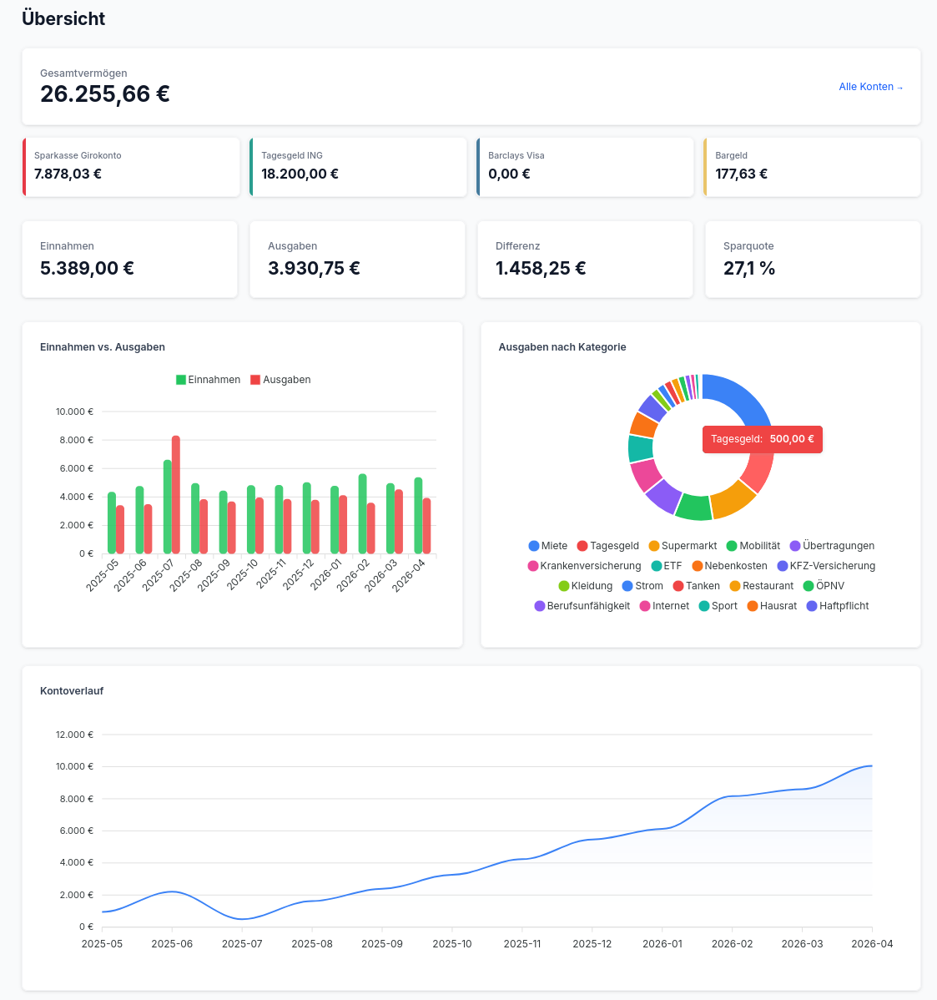
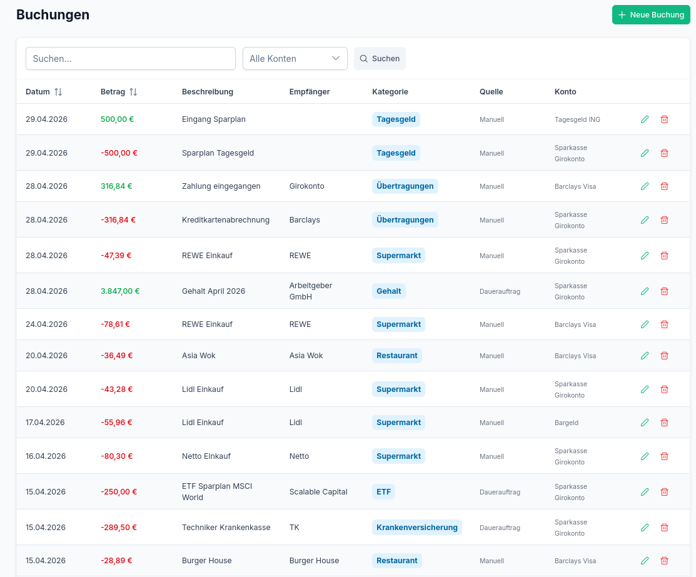
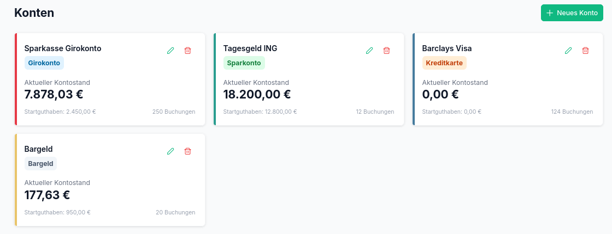
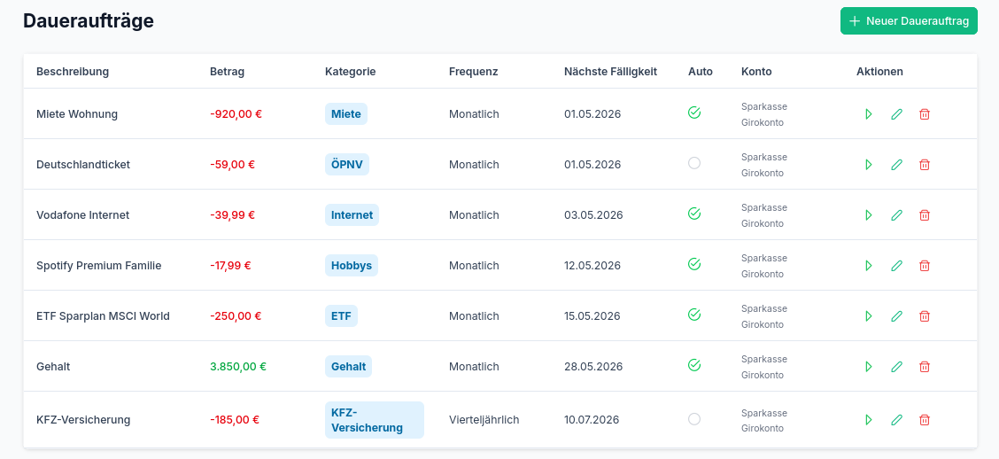
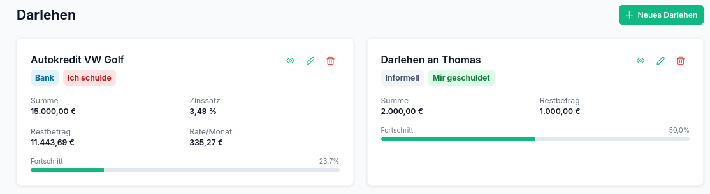
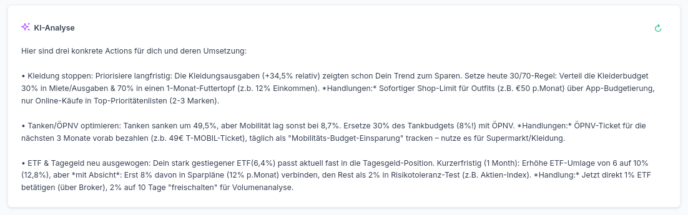

# FinanzPilot

Self-hosted personal finance web application. Track income, expenses, bank imports, recurring transactions, loans, and get AI-powered insights — all without relying on third-party SaaS.



## Features

- **Dashboard** — Income vs. expenses, category breakdown, balance trends, account overview
- **Transaction tracking** — Manual entry and CSV import (Sparkasse, PayPal, generic CSV)
- **Smart categorization** — Self-learning rule engine that improves with each manual categorization
- **Multiple accounts** — Track checking, savings, credit card, and cash accounts separately
- **Recurring transactions** — Templates with auto-generation for rent, salary, subscriptions
- **Loan management** — Bank loans with amortization schedules, informal debt tracking
- **Excel export** — German-formatted .xlsx files for tax advisors
- **AI insights** — Privacy-first financial analysis (data is anonymized before sending)
- **MCP server** — Query your finances from Claude Code or Claude Desktop

<details>
<summary>More screenshots</summary>

### Transactions


### Accounts


### Recurring Transactions


### Loans


### AI Insights


</details>

## Tech Stack

- **Backend:** Laravel 13 + PHP 8.4
- **Frontend:** Vue 3 + Inertia.js + PrimeVue + Tailwind CSS
- **Database:** SQLite (single-file backup)
- **Charts:** ApexCharts
- **Deployment:** Docker Compose (nginx + PHP-FPM)

## Quick Start

```bash
git clone https://github.com/tschaefermedia/FinanzPilot.git
cd financial-pilot
cp .env.example .env
docker compose build
docker compose up -d
docker compose exec php composer install --no-dev --optimize-autoloader
docker compose exec php php artisan key:generate
docker compose exec php php artisan migrate --force
docker compose exec php php artisan db:seed --force
```

Open `http://localhost` in your browser.

## Documentation

See [DEPLOYMENT.md](DEPLOYMENT.md) for the full deployment guide including:
- Environment configuration
- Backup & restore
- MCP server setup
- Recurring transaction scheduler
- Updating

## AI Configuration

FinanzPilot supports multiple AI providers (configured in Settings):
- **Claude** (Anthropic API)
- **OpenAI** / OpenAI-compatible APIs
- **Ollama** (local, fully offline)

All financial data is anonymized before sending — no absolute amounts, no counterparty names.

## License

MIT
